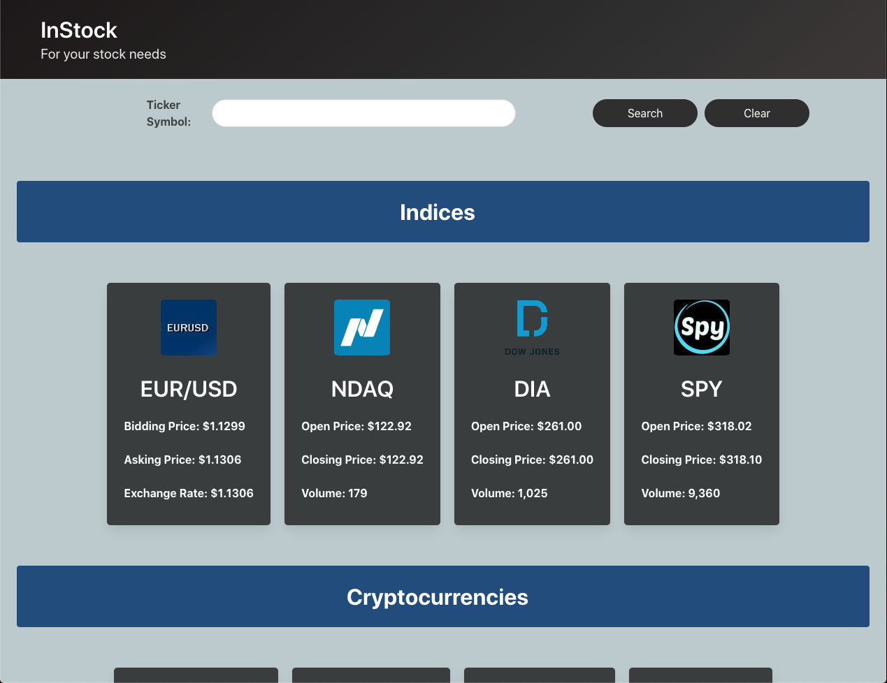
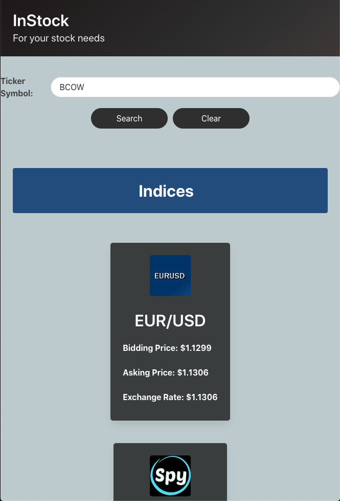

# Stock-Price-Application

This application provides the user with the most recent price data available for three different asset classes: stocks, cryptocurrencies and one currency pair. There are 8 preset assets that are listed with their opening price, closing price, and volume of shares exchanged in that trading period. This application also has a search bar that allows the user to enter any stock ticker and it will provide the same three data points as the assets listed on the home screen. The search result data will also be displayed in a modal that contains a line chart with the past 6 months of price data so as to provide the user with a clear indication of how that particular asset has performed.

<ul>
    <li>HTML</li>
    <li>CSS - Bulma</li>
    <li>JavaScript</li>
    <li>Alphavantage API</li>
    <li>Clearbit API</li>
    <li>Chart.js</li>
</ul>

